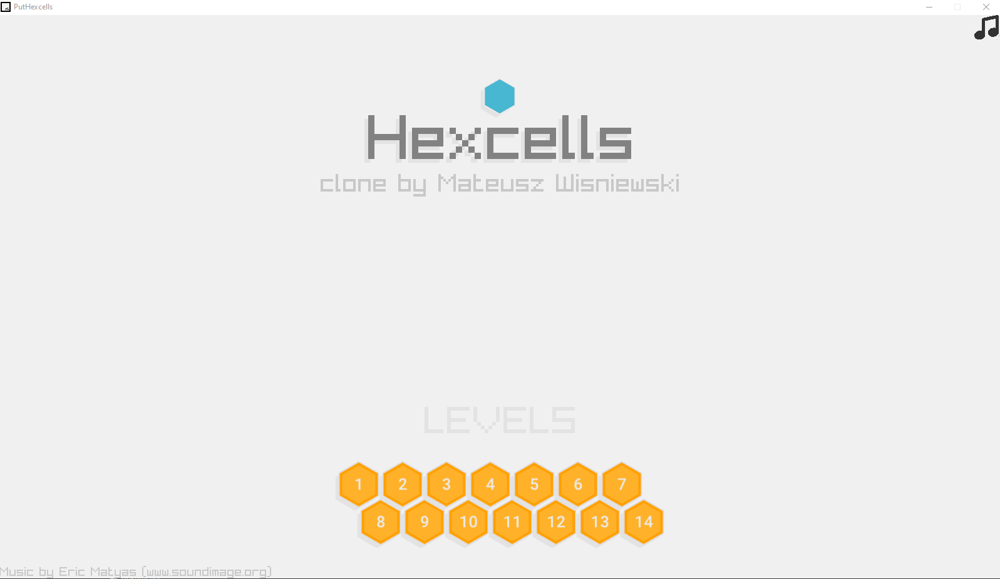
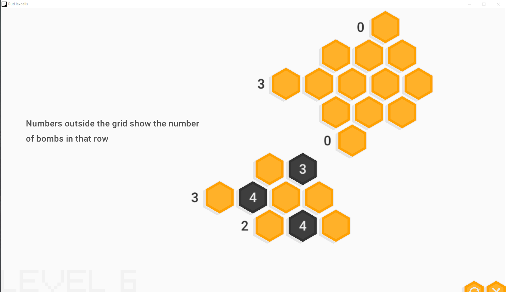
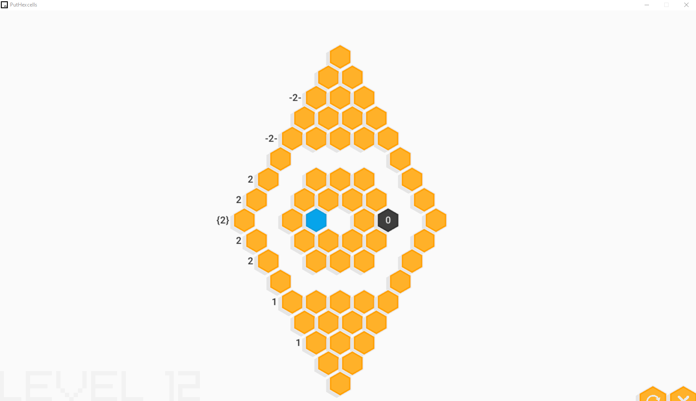

# HexcellsClone
Recreating Hexcells game in C for an uni project

Made with raylib (www.raylib.com/)

Original game: https://store.steampowered.com/app/265890/Hexcells/

## Compiling
- Install raylib
- Copy project template from raylib directory
- Put this respository files inside the template
- Build project using your IDE
